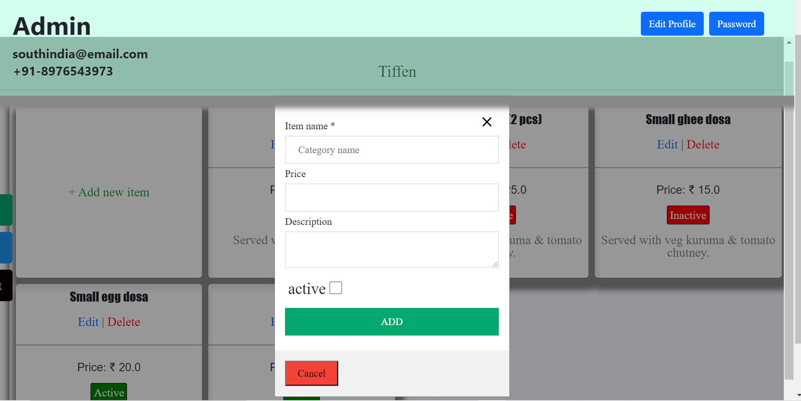

# [SouthIndia](https://southindia.herokuapp.com/)-online food shoping

#admin
  email: southindia@email.com
  password: southindia

#customer
  email:customer@email.com
  password:customer

In my application there are two users
  -Customer
  -Admin(Owner)

## Home page

-Without sign-in this is homepage() only able to see the menus if you want sign-in must.

## Sign-in page
-Sign-in() page common for both users

## Customer:
  ## Sign-up
  -If a new user sign-up().Admin cannot sign-up.
  

  ## Customer home page
  -Customer can order a food.
  

  -Customer have two pages,choosing via dropdown and SI button in the left top title page.
  

  ## Cart
  -If user add items to the cart,then appliction store the items in the database.
   so, whenever user log-in, able to see items in the cart.
  -Total odrer functinality in the cart container only.
  

  ## Address
  -First time User can add address while ordering, other wise add on profile/address.
  

  ## Orders
  -User need to see order status or old orders, then go profile and click order button and check.
  

  ## Change password
  -Click password button change password
  

  ## Delete Account
  -If user need destroy account click destroy button, it will ask password, enter and destroy.
  

  ## Edit profile
  -If user need edit the profile, click edit profile and edit the profile.
  -Both user same way to edit the profile.
  

## Admin(Owner)

  ## Admin Home page
  -This is admin home page and also menu category.
  

  -Add category, edit the categories, make active or inactive each categories and delete the category.
  -click View_items and enter the menu_items page.
  
  

  ## Menu_item page
  -As same as menu_category functionality.
  
  
  

  ## Hover side bar
  -Using hover side bar will choose menu/orders/logout.
  

  ## Change password
  -click password button and change password.
  

  ## Orders
  -Can see old orders and pending orders and make complete or cancel the order.
  
  -click view-item and see order items
  
